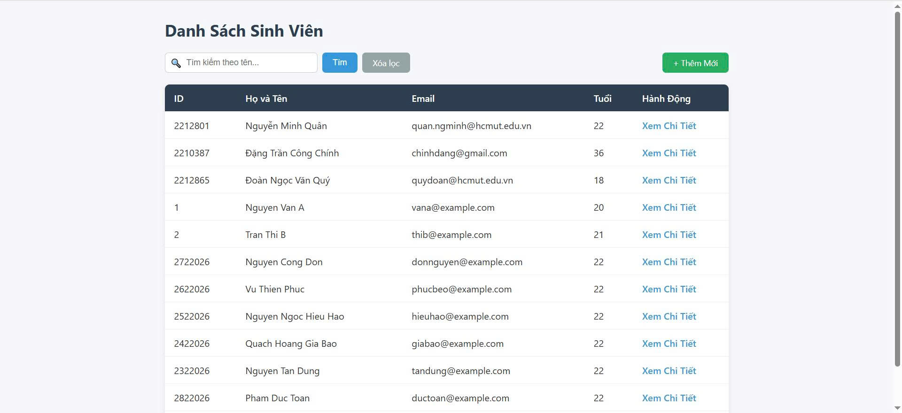
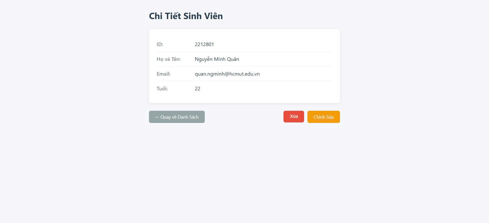
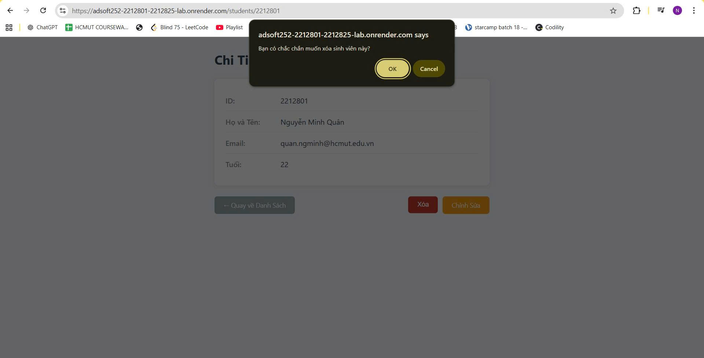
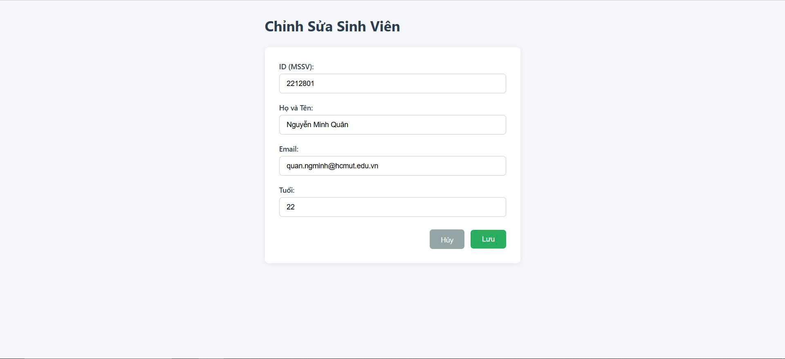

# Student Management — Ứng dụng Quản lý Sinh viên

Ứng dụng web quản lý sinh viên được xây dựng bằng **Spring Boot**, **Thymeleaf**, và **PostgreSQL**.

## Thành viên nhóm


| MSSV    | Họ và Tên              |
| ------- | ---------------------- |
| 2212825 | Từ Văn Nguyễn Anh Quân |
| 2212801 | Nguyễn Minh Quân       |

## Public URL của Web Service
https://adsoft252-2212801-2212825-lab.onrender.com/


## Cách chạy dự án (Local)

### Yêu cầu

- Java 17+
- Maven 3.9+
- PostgreSQL

### Bước 1: Cấu hình database

Tạo file `.env` tại thư mục gốc:

```env
DATABASE_URL=jdbc:postgresql://localhost:5432/student_management
DB_USERNAME=postgres
DB_PASSWORD=your_password_here
```

### Bước 2: Export các biến môi trường và chạy ứng dụng

```bash
set -a && source .env && set +a && ./mvnw spring-boot:run
```

Truy cập: [http://localhost:8080/students](http://localhost:8080/students)

## Trả lời các câu hỏi lý thuyết trong phần Lab

### Q2. Ràng buộc Khóa Chính (Primary Key)

Khi cố tình INSERT một sinh viên có `id` trùng với một sinh viên đã tồn tại, hệ quản trị cơ sở dữ liệu sẽ báo lỗi:

> UNIQUE constraint failed

Nguyên nhân là vì cột `id` được khai báo là **PRIMARY KEY**.

Primary Key có hai đặc tính quan trọng:

- Không được trùng giá trị (UNIQUE)
- Không được chứa giá trị NULL

Khi chèn một bản ghi có `id` trùng, cơ sở dữ liệu phát hiện vi phạm tính duy nhất của khóa chính và từ chối thao tác này. Điều này nhằm:

- Đảm bảo mỗi sinh viên chỉ có một bản ghi duy nhất trong hệ thống
- Tránh mâu thuẫn và trùng lặp dữ liệu

Đây là cơ chế đảm bảo **toàn vẹn thực thể (Entity Integrity)** trong cơ sở dữ liệu quan hệ.
---

### Q3. Toàn vẹn dữ liệu (Constraints)

Khi thử INSERT một sinh viên nhưng để cột `name` là NULL, cơ sở dữ liệu không báo lỗi.

Nguyên nhân là vì trong cấu trúc bảng, cột `name` không được khai báo ràng buộc `NOT NULL`, do đó Database vẫn chấp nhận giá trị NULL.

Việc thiếu ràng buộc này có thể gây ra một số vấn đề:

- Dữ liệu không đầy đủ (sinh viên không có tên)
- Có thể gây lỗi `NullPointerException` trong Java nếu không kiểm tra null trước khi sử dụng
- Ảnh hưởng đến logic nghiệp vụ và hiển thị giao diện

Điều này cho thấy cần đảm bảo toàn vẹn dữ liệu ở cả hai mức:

- Tầng cơ sở dữ liệu (thêm `NOT NULL`)
- Tầng ứng dụng (validation như `@NotBlank`, `@NotNull`)

---

### Q4. Cấu hình Hibernate

Mỗi lần tắt ứng dụng và chạy lại, dữ liệu cũ trong Database bị mất là do cấu hình:

```
spring.jpa.hibernate.ddl-auto=create
```

Giá trị `create` có nghĩa là:

- Khi ứng dụng khởi động, Hibernate sẽ xóa toàn bộ bảng cũ
- Sau đó tạo lại bảng mới dựa trên Entity

Vì vậy, dữ liệu cũ bị xóa hoàn toàn mỗi lần restart.

Để giữ lại dữ liệu khi khởi động lại ứng dụng, nên sử dụng:

```
spring.jpa.hibernate.ddl-auto=update
```

Chế độ `update` sẽ cập nhật cấu trúc bảng nếu cần nhưng vẫn giữ nguyên dữ liệu hiện có.
## Screenshot cho các module trong Lab 4
---

### 1.1 Trang Danh Sách (List View)

- **Đường dẫn (URL):** `/students`

#### Yêu cầu giao diện:

- Hiển thị danh sách toàn bộ sinh viên dưới dạng bảng.
- Tích hợp ô nhập liệu để **tìm kiếm sinh viên theo tên**.
- Nút **"Thêm Mới"** để điều hướng sang trang tạo sinh viên.
- Mỗi dòng dữ liệu có liên kết **"Xem Chi Tiết"**.

#### Giao diện minh họa:



---

### 1.2 Trang Chi Tiết (Detail View)

- **Đường dẫn (URL):** `/students/{id}`

#### Yêu cầu giao diện:

- Hiển thị đầy đủ thông tin của sinh viên:
  - ID
  - Tên
  - Email
  - Tuổi
- Nút **"Chỉnh Sửa"** để cập nhật thông tin.
- Nút **"Xóa"**:
  - Có hộp thoại xác nhận (Confirm Dialog) trước khi xóa.
  - Sau khi xóa thành công → Điều hướng về Trang Danh Sách.

#### Giao diện minh họa:



#### Confirm Dialog khi xóa:



---

### 1.3 Chức Năng Thêm & Sửa

#### Thêm Mới

- Form nhập liệu gồm:
  - Tên
  - Email
  - Tuổi
- Sau khi lưu thành công → Quay về Trang Danh Sách.

**Giao diện Thêm Mới:**


---

#### Chỉnh Sửa

- Form tương tự như Thêm Mới.
- Các trường đã được điền sẵn thông tin cũ.
- Sau khi lưu thành công:
  - Điều hướng về Trang Danh Sách  
  **hoặc**
  - Điều hướng về Trang Chi Tiết.

**Giao diện Chỉnh Sửa:**



---

## Công nghệ sử dụng

- **Backend:** Spring Boot 4.0.2, Spring Data JPA
- **Frontend:** Thymeleaf Template Engine
- **Database:** PostgreSQL (Neon.tech serverless)
- **Build:** Maven, Docker (multi-stage)
- **Deploy:** Render.com (Web Service)

## Chức năng


| Chức năng    | URL                          | Mô tả                            |
| ------------ | ---------------------------- | -------------------------------- |
| Danh sách SV | `GET /students`              | Hiển thị bảng, tìm kiếm theo tên |
| Chi tiết SV  | `GET /students/{id}`         | Xem thông tin chi tiết           |
| Thêm mới     | `GET /students/new`          | Form thêm sinh viên              |
| Lưu mới      | `POST /students`             | Xử lý thêm sinh viên             |
| Chỉnh sửa    | `GET /students/{id}/edit`    | Form sửa (điền sẵn data)         |
| Cập nhật     | `POST /students/{id}`        | Xử lý cập nhật                   |
| Xóa          | `POST /students/{id}/delete` | Xóa với xác nhận                 |

## Cấu trúc project

```
src/main/java/vn/edu/hcmut/cse/adsoftweng/lab/
├── controller/
│   └── StudentController.java      # MVC Controller
├── entity/
│   └── Student.java                # JPA Entity
├── repository/
│   └── StudentRepository.java      # Spring Data JPA Repository
├── service/
│   ├── IStudent.java               # Service Interface
│   └── StudentImpl.java            # Service Implementation
└── StudentManagementApplication.java

src/main/resources/
├── templates/
│   ├── students.html               # Trang danh sách
│   ├── student-detail.html         # Trang chi tiết
│   └── student-form.html           # Form thêm/sửa
└── application.properties
```

## Triển khai (Deployment)

### Docker

Build thử docker ở local.

```bash
docker build -t student-management:latest .
docker run -p 8080:8080 \
  -e DATABASE_URL=jdbc:postgresql://host/db \
  -e DB_USERNAME=user \
  -e DB_PASSWORD=pass \
  student-management:latest
```

### Render.com + Neon.tech

1. Tạo database trên [Neon.tech](https://neon.com)
2. Tạo Web Service trên [Render.com](https://render.com) -> chọn Docker runtime
3. Cấu hình Environment Variables:
   - `DATABASE_URL`: Connection string từ Neon (thêm prefix `jdbc:`)
   - `DB_USERNAME`: Username
   - `DB_PASSWORD`: Password
4. Deploy — Render auto-deploy khi push lên `main`
